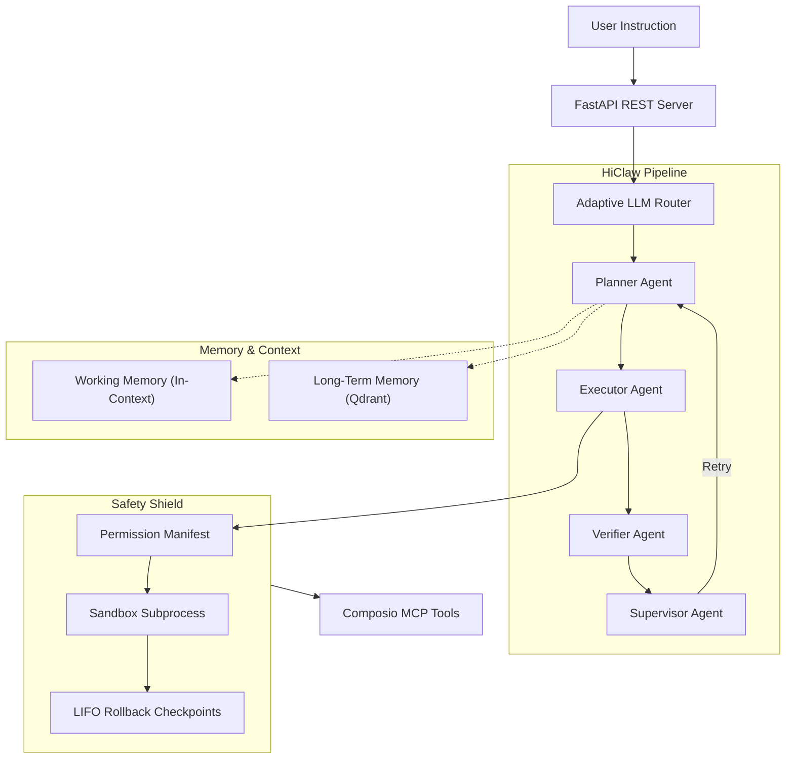

# 🌌 ORION: Autonomous OS Automation Agent

<p align="center">
  
  
  
  
  
  
</p>

---

## 📖 Overview

**ORION** is a professional-grade autonomous agent designed for high-stakes OS automation. Unlike simple script-generating agents, ORION uses a **hierarchical multi-agent pipeline** ("HiClaw") to decompose instructions into dependency-aware graphs, execute them through a defensive safety shield, and verify results before completion.

Whether it's managing complex GitHub workflows, automating browser tasks, or executing shell operations, ORION ensures every step is **traceable, safe, and recoverable.**

---

## 🏗️ Architecture

ORION follows a strict layered architecture to ensure modularity and production stability.



---

## ✨ Key Features

### 🧠 Intelligent Orchestration
*   **HiClaw Pipeline**: A 4-agent hierarchy that prevents "hallucination loops" by separating planning from execution and verification.
*   **Adaptive LLM Routing**: Automatic failover between **vLLM** (Local), **Groq** (Fast Cloud), and **OpenRouter** (Fallback) with integrated circuit breakers.

### 🛡️ Industrial Safety
*   **Permission Manifests**: Granular YAML-based control over which tools, paths, and commands are allowed.
*   **Destructive Op Gate**: Automatic classification of risk levels (Low/High) with mandatory human-in-the-loop approval for high-risk changes.
*   **Sandbox Isolation**: All shell and system operations run in restricted subprocesses with resource caps.

### 💾 Deep Memory
*   **Two-Tier Learning**: Uses a sliding-window working memory for the current task and a Qdrant-backed vector store for persistent semantic retrieval of past successes.

### 🔭 Full Observability
*   **TLP Stack**: Structured Logging (**T**racing with LangSmith, **L**ogging with structlog, **P**rometheus metrics).
*   **Admin Dashboard**: Real-time Grafana boards for monitoring token costs, latency, and agent success rates.

---

## 🚀 Quick Start

### Installation

```bash
# Clone the repository
git clone https://github.com/Srikhanth0/ORION.git
cd ORION

# Install dependencies using 'uv'
make install

# Configure your environment
cp .env.example .env
# Edit .env and add your GROQ_API_KEY
```

### Starting the Engine

```bash
# Start the API server
make dev

# OR run the full production stack via Docker
make docker-up
```

---

## ⚙️ User Configuration

ORION is highly configurable via YAML files in the `configs/` directory.

| Config | File | Description |
| :--- | :--- | :--- |
| **LLM Routing** | `llm/router.yaml` | Define the fallback chain and role-based model assignments. |
| **Permissions** | `safety/permissions.yaml` | Whitelist/Blacklist specific shell patterns and filesystem paths. |
| **Sandbox** | `safety/sandbox.yaml` | Set timeouts, memory limits, and gate-mode (Strict vs Auto). |
| **Tools** | `mcp/composio.yaml` | Configure API keys and enabled apps for tool execution. |

### Environment Variables (.env)
*   `GROQ_API_KEY`: Required for fast inference.
*   `MAX_CONCURRENT_TASKS`: Defaults to 5.
*   `ORION_ENV`: Set to `production` for JSON logging.

---

## 📡 API Reference

### Core Endpoints

| Method | Endpoint | Description |
| :--- | :--- | :--- |
| `POST` | `/v1/tasks` | Submit a task. Returns `task_id`. |
| `GET` | `/v1/tasks/{id}/stream` | SSE stream of real-time agent thoughts and actions. |
| `GET` | `/v1/tools` | List all 28+ registered MCP tools and their schemas. |
| `GET` | `/ready` | Readiness probe (checks Qdrant and LLM health). |

### Example Task Submission

```bash
curl -X POST http://localhost:8080/v1/tasks \
  -H "Content-Type: application/json" \
  -d '{"instruction": "List all .py files in /workspace and create a summary.txt"}'
```

---

## 🛠️ Development & Ops

We provide a comprehensive `Makefile` for all lifecycle operations:

*   `make test`: Run the full 176-test suite.
*   `make eval`: Run the 10 canonical end-to-end evaluation tasks.
*   `make health`: Diagnostic check for all local and remote dependencies.
*   `make clean`: Flush caches and temporary artifacts.

---

## 📜 License

Distributed under the MIT License. See `LICENSE` for more information.

---

<p align="center">
  Built with ❤️ for the future of OS Automation.
</p>